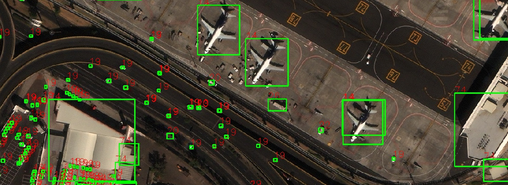

# YOLOv5 Object Detcetion Streamlit App

## Summary
An application that ultilizes YOLOv5 to detect objects in an image.

## Installation
``` 
    *clone the repository*
    cd YoloV5_Streamlit
    pip install -r requirements.txt
    streamlit run app.py
```

## Example



## Made Possible with Adapatation from:
#### Implementation -> https://github.com/ultralytics/yolov5 🙏
#### Paper (Yolo) -> https://arxiv.org/abs/1804.02767
