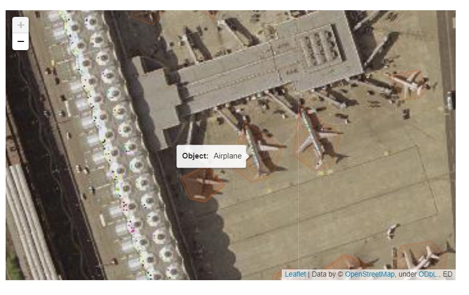

# Web Map Streamlit App

## Summary
An application that ultilizes ellipsis and folium to display a raster satellite image and a vector object dectection data in a web app in streamlit using leaftlet and open street maps.

## Installation
``` 
    *clone the repository*
    cd web_map_streamlit
    pip install -r requirements.txt
    streamlit run app.py
```


## Example



## Made Possible with Adapatation from:
#### Implementation -> https://medium.com/@daniel_819/a-web-map-in-10-lines-of-code-with-streamlit-ellipsis-and-folium-6e41f7407d68

